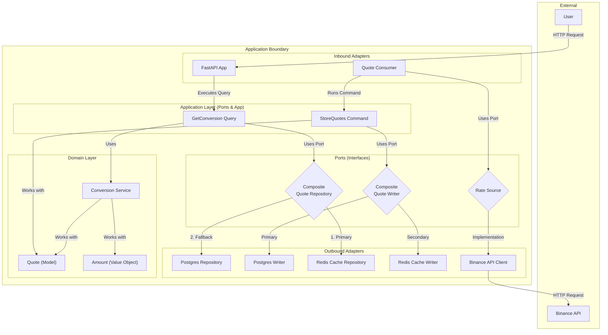

# Architecture Overview

This project is built with **Hexagonal Architecture**, **Domain-Driven Design (DDD)**, and **CQRS**.

## System Diagram

## Core Patterns

### 1. Hexagonal Architecture (Ports & Adapters)

The application is structured to isolate the core business logic from outside concerns.

- **Domain** (`converter/domain`): Contains the core business logic, models, and rules. Key components include the `Quote` model and value objects like `Pair`, `Rate`, and `Amount`.

- **Application Layer** (`converter/app`): Orchestrates the business logic to fulfill use cases.

- **Adapters** (`converter/adapters`): These are the concrete implementations of the ports.
  - **Inbound Adapters**: Drive the application. This includes the FastAPI web server and the `QuoteConsumer` background worker.
  - **Outbound Adapters**: Are driven by the application. This includes `PostgresQuoteRepository` (for database interaction), `RedisQuoteRepository` (for caching), and `BinanceStreamingRateSource` (for fetching data from Binance).

### 2. CQRS (Command Query Responsibility Segregation)

The application separates read operations (Queries) from write operations (Commands).

- **Query**: `GetConversionQueryHandler` is responsible for fetching quotes and calculating conversions.
- **Command**: `StoreQuotesCommandHandler` is responsible for persisting new quotes fetched from the external API.

### 3. Dependency Injection

The project uses the `dependency-injector` library (`converter/shared/di/container.py`) to manage the construction and wiring of components.